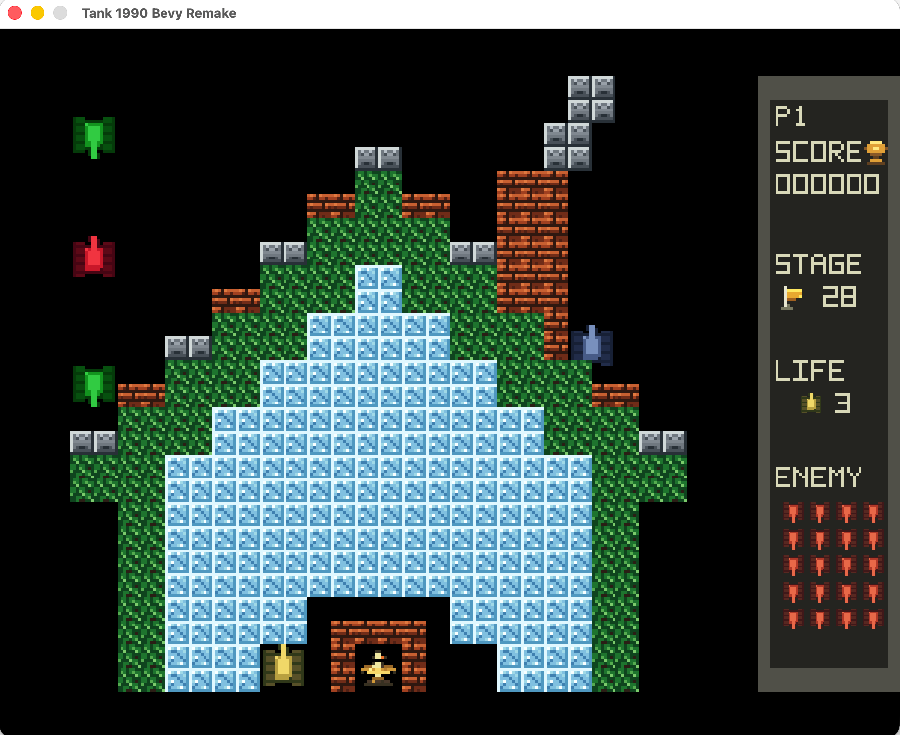

# Tank 1990 Bevy Remake

A Rust + Bevy desktop remake inspired by Tank 1990 / Battle City. The project
uses a 256x240 virtual screen, nearest-neighbor sprites, 26x26 small-tile maps,
campaign stages, local versus arenas, power-ups, retro generated sounds, and
gitignored personal asset overrides for private playtesting.




## Run

```bash
cargo run
```

The default window scale is 3x. Music, sound, and scale are controlled from the
main menu settings, not environment variables. For capture or small displays,
choose a crisp integer scale from the main menu `SCALE` setting: `2X`, `3X`, or
`4X`.

## Controls

Mode select:

- `W` / `S` or arrow up/down: move between mode and settings rows
- `A` / `D` or arrow left/right: change the selected row, including `MAP`,
  `STAGE`, `ARENA`, `VIEW`, `AI`, `DIFF`, `MUSIC`, `SOUND`, and `SCALE`
- `Space`, `Enter`, or `RightShift`: start selected mode, or toggle the selected
  setting

In game:

- P1 2D move: `W` `A` `S` `D`
- P1 3D drive: `W` / `S` move forward/backward, `A` / `D` tap-turn left/right
- P1 fire: `Space`
- P2 2D move: arrow keys
- P2 fire: `Enter` or `RightShift`
- Pause/resume: `P`, `Esc`, or `Pause`
- Restart current stage or round: `R`
- Return to mode select: `M`
- Toggle fullscreen: `F`
- Toggle 2D/3D view: `V`, `3`, or numpad `3`
- Switch the followed player in two-player 3D modes: `Tab`

The 3D mode is currently an experimental single-camera view. In two-player
co-op or versus, the camera follows one player at a time and `Tab` switches
between P1 and P2; split-screen 3D is not implemented yet.

## Install

Install the latest crates.io release with:

```bash
cargo install tank1990
```

The published crate is named `tank1990`, and it installs a `tank` executable.
For local development, `cargo run` and `cargo install --path .` use the same
binary name.

## Current Content

- Campaign `ORIGINAL`: 35 strict classic layouts in `assets/levels_original/`
  selected by default.
- Campaign `CUSTOM`: 50 authored/custom stages in `assets/levels/`.
- Versus: 8 authored arenas in `assets/arenas/`.
- Arenas 5, 6, and 8 are `BaseBattle`; the others are `Deathmatch`.
- Generated placeholder sprite atlases and sounds are used when no personal
  override exists.
- Original campaign layouts are sourced from the GPLv3 `battle-city-tanks`
  archive; see `assets/levels_original/README.md`.

## Distribution

Build the release executable with:

```bash
cargo build --release
```

Then run the binary directly:

```bash
./target/release/tank
```

The default asset manifest, campaign map packs, versus arenas, generated
sprites, and generated sounds are built into the executable, so the default game
can be distributed as one platform-specific binary without an `assets/`
directory. Optional private overrides still work when `assets/personal/` is
present next to the working directory used to launch the game. This is
asset-free distribution, not a fully static Linux build; target systems may
still need the usual graphics and audio runtime libraries.

Tag-based GitHub Releases are published by `.github/workflows/release.yml`.
Pushing a version tag such as `v0.1.0` builds Linux, macOS, and Windows release
archives that each contain only the executable, plus a `tank-web.zip` browser
build:

```bash
git tag v0.1.0
git push origin v0.1.0
```

Release tags must match the Cargo package version. For example, `Cargo.toml`
version `0.1.0` must be released with tag `v0.1.0`.

The macOS binary is not codesigned or notarized. Gatekeeper may warn on first
launch; use the standard macOS "Open Anyway" flow or build locally with
`cargo build --release` if you prefer a locally produced binary.

## Browser Build

The game can also be built as a static WebAssembly package:

```bash
rustup target add wasm32-unknown-unknown
scripts/install-wasm-bindgen.sh
scripts/build-web.sh
```

The build is written to `dist/web/`. Serve that directory with any static HTTP
server, for example:

```bash
python3 -m http.server 8080 --directory dist/web
```

Then open `http://127.0.0.1:8080/`. Browser audio may start only after the
first click or key press, which is normal browser autoplay policy behavior.

GitHub Pages is published by `.github/workflows/pages.yml` on pushes to `main`
or manual workflow dispatch. The release workflow uploads the same browser build
as `tank-web.zip`.

## crates.io Publishing

Before publishing a crate release, run:

```bash
cargo fmt --all -- --check
cargo test --locked
cargo clippy --locked --all-targets -- -D warnings
cargo package --allow-dirty --list
cargo publish --dry-run --allow-dirty
```

After the dry run succeeds, publish with:

```bash
cargo publish
```
